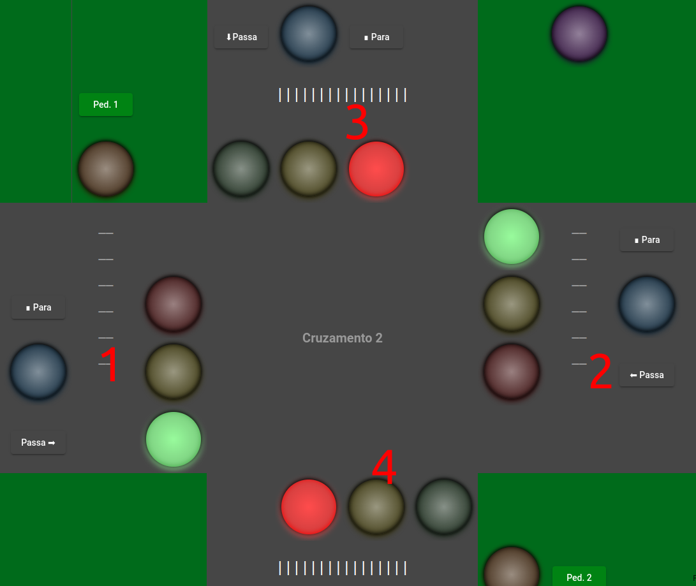

[](https://classroom.github.com/online_ide?assignment_repo_id=11984101&assignment_repo_type=AssignmentRepo)

# Trabalho 1 (2023-2)

Trabalho 1 da disciplina de Fundamentos de Sistemas Embarcados (2023/2)

## Estrutura do Projeto

A estrutura do projeto é divida em um Servidor Central ([central](central)), Servidor Distriubuído 1 ([server1](server1)) e um Servidor Distribuído 2 ([server2](server2)). Além disso, no diretório [modelconfig](modelconfig) está a configuração em formato JSON de host, porta, GPIO de entrada e GPIO de saída para cada Servidor Distribuído (cruzamento 1 e 2). Cada diretório possui o módulo ModelConfig.py que é responsável por ler este arquivo JSON e configurar o funcionamento dos servidores.

### Servidor Central

- [main.py](central/main.py): instancia a classe de configuração e inicia a aplicação
- [Application.py](central/Application.py): gerencia o controle de tráfego nos dois cruzamentos, permitindo a configuração de modos de operação (Emergência, Noturno e Normal) em servidores distintos (Server 1 e Server 2). A aplicação recebe dados de tráfego dos servidores, atualiza relatórios de contagem de carros e fornece informações sobre o tráfego, incluindo contagens, avanços no sinal vermelho e velocidades. Além disso, a aplicação armazena de modo persistente (arquivo JSON) o estado atual (número de infrações, velocidade da pista, etc) para que possa ser re-estabelecido em caso de queda de energia.
- [ListeningServer.py](central/ListeningServer.py): é responsável por receber, processar e atualizar as informações de contagem de carros em um cruzamento específico, contribuindo para o controle de tráfego em um projeto de gerenciamento de cruzamento.
- [MessageHandler.py](central/MessageHandler.py): é responsável por ler, manter, atualizar e processar os dados de contagem de carros em vários cruzamentos, bem como salvar esses dados em um formato JSON para posterior referência ou análise.
- [Client.py](central/Client.py): é responsável por enviar comandos aos servidores distribuídos responsáveis pelo controle dos cruzamentos.

### Servidores Distribuídos

- [TrafficServer.py](server1/TrafficServer.py): configura e gerencia os semáforos de trânsito, lida com os botões de controle e contabiliza a quantidade de carros, avanços no sinal vermelho e velocidades. Ele também estabelece uma conexão com o servidor central e recebe instruções de modo de operação (por exemplo, Modo de Emergência, Modo Noturno). Quando uma nova instrução de modo é recebida, o servidor ajusta o semáforo de acordo com o modo especificado.
- [Listening.py](server1/Listening.py): é responsável por receber mensagens do servidor princiapl em um determinado host e porta. Ele aguarda a chegada de mensagens em formato JSON por meio de uma conexão de soquete. 
- [Client.py](server1/Client.py): coleta informações sobre o tráfego de um cruzamento, como contagem de carros, avanços no sinal vermelho, velocidades e outros dados. Ele formata essas informações em um objeto JSON e envia periodicamente esses dados para o servidor central em intervalos de 2 segundos.
- [TrafficLightControler.py](server1/src/TrafficLightController.py): controla os semáforos em um cruzamento, ajustando sua temporização com base no modo de operação. Além disso, monitora infrações, como avanços de sinal vermelho e alta velocidade, acionando um buzzer como alerta. O buzzer também é ativado quando o cruzamento de pedestres está prestes a ser fechado. 
- [ButtonsControl.py](server1/src/ButtonsControl.py): controla botões, sensores de tráfego e a velocidade dos carros em um cruzamento. Ele gerencia callbacks para os botões de pedestres, detecta quando um sensor de tráfego é acionado e calcula a velocidade dos carros com base no tempo que levam para passar pelo sensor. Além disso, ele monitora se um carro parou em um sensor e fornece essa informação para outros módulos. Basicamente, ele é responsável por lidar com entradas do usuário

## Como rodar o projeto

1. Instale o package [RPi.GPIO](https://pypi.org/project/RPi.GPIO/): ```pip install RPi.GPIO```
2. Entre na pasta dos servidores e execute a respectiva main.py:
   1. Servidor central:
      - ```cd central```
       - ``` python3 main.py```
    2. Servidor 1:
         - ```cd server1```
        - ``` python3 main.py```
    3. Servidor 1:
         - ```cd server2```
        - ``` python3 main.py```

## Observações:

As informações sobre número de carros, número de avanço de sinal vermelho, número de velocidade acima do permitido e velocidade média de cada via é apresentado em uma lista da seguinte forma: [*1*, *2*, *3*, *4*], onde:



## Vídeo de Apresentação

<a href='https://youtu.be/3JRyRZ65adc'></a>


<!-- <iframe width="560" height="315" src="https://www.youtube.com/embed/L9AdojDWzSM?si=2II3Dozuop4gL8Oe" title="YouTube video player" frameborder="0" allow="accelerometer; autoplay; clipboard-write; encrypted-media; gyroscope; picture-in-picture; web-share" allowfullscreen></iframe> -->
